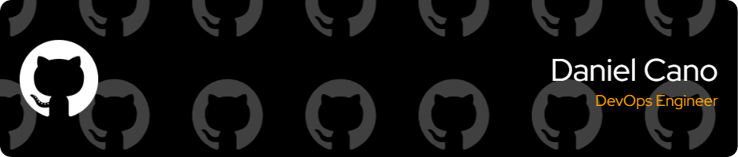

# About Me

Hello! 👋 I'm **Dani**, a passionate and dedicated **DevOps** professional and tech enthusiast. 

Currently, I am focused on expanding my skills in DevOps and systems automation, working with various tools such as **Docker**, **Kubernetes**, **Terraform**, and **CI/CD pipelines**. I also have experience in **Linux administration** and am always looking for new challenges to improve my expertise.

## 🚀 What I'm working on:
- Learning more about **cloud infrastructure**, specifically AWS and GCP.
- Building a **DevOps portfolio** with practical projects to showcase my skills.
- Automating tasks and processes using **Terraform** and **Ansible**.
- Working on improving my **Linux sysadmin** knowledge to reach an advanced level (Linux N3).

## 🔧 Technologies & Tools:
- **Languages**: Bash, PowerShell, Python
- **DevOps Tools**: Docker, Kubernetes, Terraform, Jenkins, GitLab CI
- **Cloud Providers**: AWS, GCP
- **Operating Systems**: Linux (Ubuntu, CentOS), Windows
- **Other**: Grafana, Graylog, Kibana, Nginx

## 📚 Learning Goals:
- Achieve an advanced level in **Linux systems administration**.
- Continue improving my skills in **DevOps** to land a **Junior DevOps** position.
- Build 100 practical mini-projects to enhance my expertise in different DevOps technologies.

## 🌱 Fun Fact:
I am also into fitness, with a special focus on strength training. I'm passionate about improving my physique and always challenge myself to push my limits.

Feel free to explore my projects and check out my ongoing learning journey. I am open to collaborating on exciting projects and always happy to connect with other tech enthusiasts. 💻🌟

Let's build something great together! 🚀

<!--
**dcanogi/dcanogi** is a ✨ _special_ ✨ repository because its `README.md` (this file) appears on your GitHub profile.

Here are some ideas to get you started:

- 🔭 I’m currently working on ...
- 🌱 I’m currently learning ...
- 👯 I’m looking to collaborate on ...
- 🤔 I’m looking for help with ...
- 💬 Ask me about ...
- 📫 How to reach me: ...
- 😄 Pronouns: ...
- ⚡ Fun fact: ...
-->
